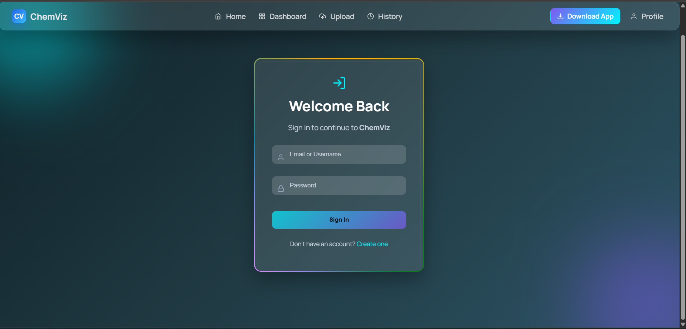
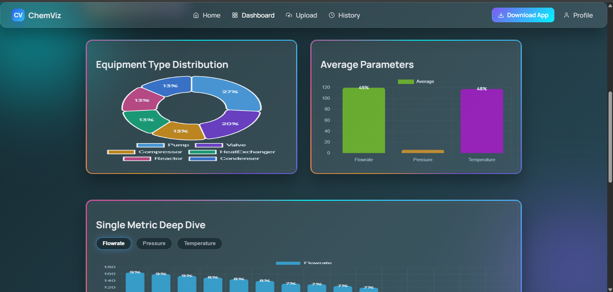
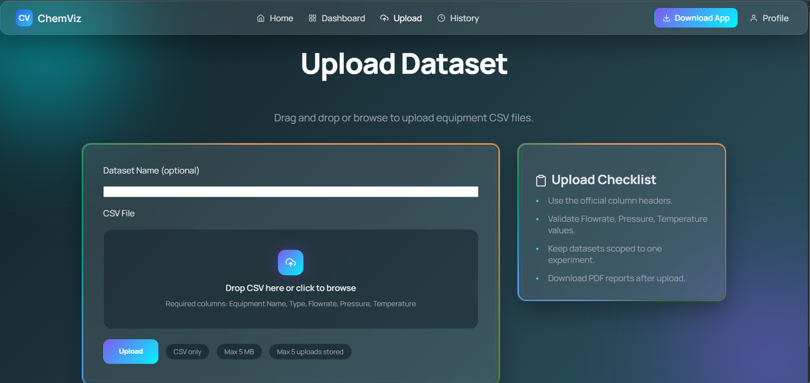
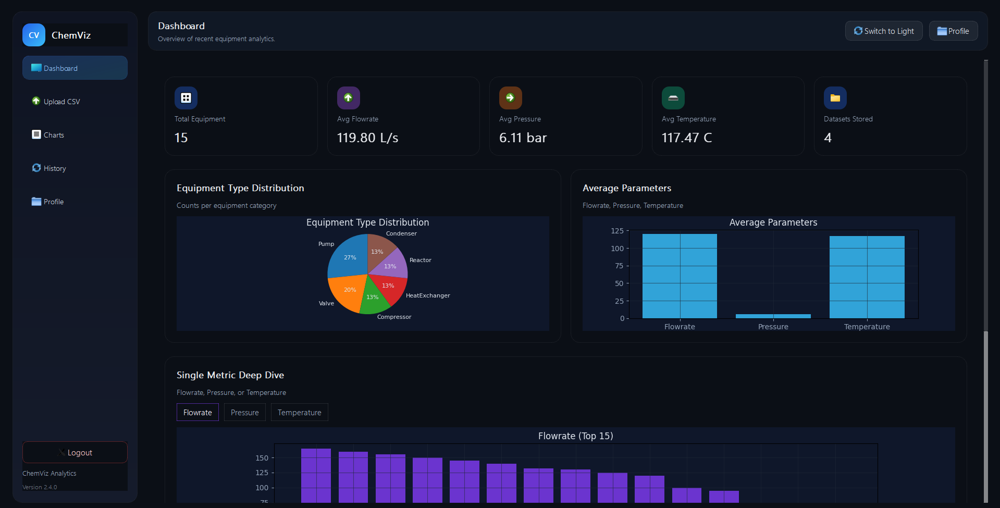
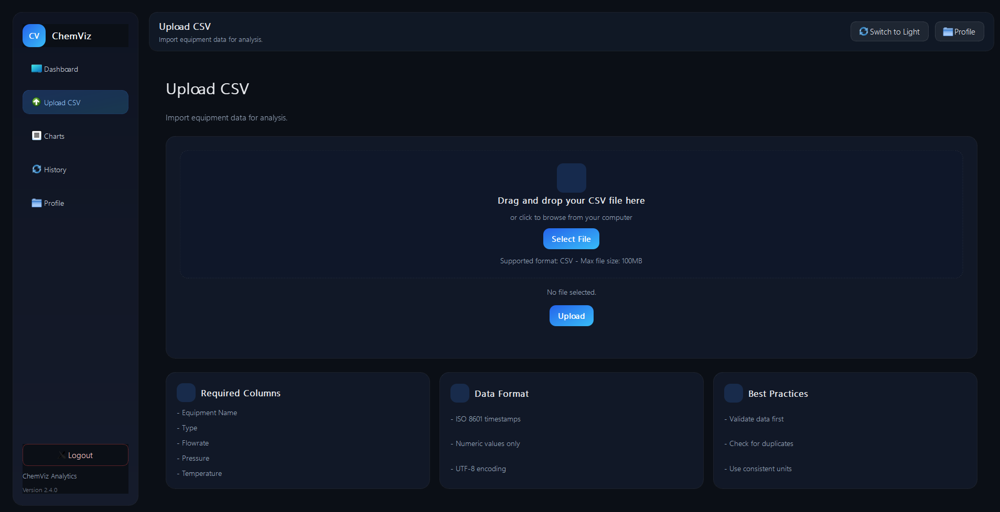

# ChemViz - Chemical Equipment Parameter Visualizer

ChemViz is a hybrid Web + Desktop application for uploading chemical equipment datasets,
calculating analytics, and visualizing results. It includes a Django REST backend, a
React + Chart.js web frontend, and a PyQt5 + Matplotlib desktop app.

## Highlights
1. CSV upload with schema and data validation
2. Validation summary (accepted/rejected rows, row-level issues)
2. Summary analytics (count, averages, type distribution)
3. Charts on both web and desktop
4. History + audit details (rows, file size, uploader)
5. Last 5 uploads stored per user
6. PDF report generation (polished layout)
7. Token-based authentication

## Architecture
CSV -> Django REST API -> Analytics (Pandas) -> Web (React) / Desktop (PyQt5)

## Architecture Diagram (ASCII)
```
            +-------------------+
            |   CSV Dataset     |
            +---------+---------+
                      |
                      v
            +-------------------+
            | Django REST API   |
            |  Upload + Auth    |
            +---------+---------+
                      |
                      v
            +-------------------+
            |  Pandas Analytics |
            |  Summary + Types  |
            +---------+---------+
                      |
        +-------------+-------------+
        |                           |
        v                           v
  +-------------+             +--------------+
  |  React Web  |             |  PyQt Desktop|
  | Chart.js UI |             | Matplotlib UI|
  +-------------+             +--------------+
```

## Tech Stack
1. Backend: Django, DRF, Pandas, SQLite
2. Web: React, Chart.js
3. Desktop: PyQt5, Matplotlib

## Project Structure
```
ChemViz/
|-- backend/                # Django + DRF + Pandas
|-- web-frontend/           # React + Chart.js
|-- desktop-app/            # PyQt5 + Matplotlib
|-- sample_data/            # Sample CSVs
|-- requirements.txt        # Combined Python deps (backend + desktop)
`-- README.md
```
Backend documentation:
```
backend/README.md
```

## Prerequisites
1. Python 3.11+ (recommended)
2. Node.js 18+ and npm
3. Git

## Quick Start Scripts
Run setup once, then start everything with one command.

Windows PowerShell:
```powershell
scripts\\setup.ps1
scripts\\run-all.ps1
```

Git Bash / macOS / Linux:
```bash
bash scripts/setup.sh
bash scripts/run-all.sh
```

## Backend Setup (Django + DRF)
1. Create and activate a virtual environment:
```powershell
python -m venv backend\.venv
backend\.venv\Scripts\Activate.ps1
```

2. Install dependencies:
```powershell
python -m pip install --upgrade pip
python -m pip install -r requirements.txt
```

3. Run migrations:
```powershell
python backend\manage.py migrate
```

4. Create a superuser (optional, for admin):
```powershell
python backend\manage.py createsuperuser
```

5. Start the backend:
```powershell
python backend\manage.py runserver
```

Backend runs at:
```
http://127.0.0.1:8000
```

## Web Frontend Setup (React + Chart.js)
1. Install dependencies:
```powershell
cd web-frontend\chemviz-web
npm install
```

2. Start the dev server:
```powershell
npm run dev
```

Frontend runs at:
```
http://localhost:5173
```

Optional API base URL (create `.env` inside `web-frontend/chemviz-web`):
```
VITE_API_BASE_URL=http://127.0.0.1:8000
```

## Desktop App Setup (PyQt5 + Matplotlib)
1. Install desktop requirements (if not using combined requirements.txt):
```powershell
python -m pip install -r desktop-app\chemviz-desktop\requirements.txt
```

2. Run the app:
```powershell
cd desktop-app\chemviz-desktop
python main.py
```

## Build Desktop Executable (PyInstaller)
From `desktop-app/chemviz-desktop`:
```powershell
pyinstaller --noconsole --onefile --name ChemVizDesktop --add-data "assets;assets" main.py
```

The executable will be created at:
```
desktop-app/chemviz-desktop/dist/ChemVizDesktop.exe
```

## Authentication
Login:
```
POST /api/auth/token/
{
  "username": "email_or_username",
  "password": "your_password"
}
```

Register:
```
POST /api/auth/register/
{
  "full_name": "Your Name",
  "email": "name@domain.com",
  "password": "StrongPass1",
  "confirm_password": "StrongPass1"
}
```

Use the token:
```
Authorization: Token <token>
```

## Key API Endpoints
1. POST /api/auth/register/ - register
2. POST /api/auth/token/ - login
3. POST /api/auth/logout/ - logout
4. GET  /api/auth/me/ - profile
5. POST /api/upload/ - upload CSV
6. GET  /api/summary/ - last 5 summaries (per user)
7. GET  /api/history/ - alias for summaries
8. GET  /api/datasets/latest/ - latest rows
9. GET  /api/datasets/report/<id>/ - PDF report by upload id
10. GET /api/report/pdf/ - latest PDF report

## CSV Requirements
Required columns:
```
Equipment Name, Type, Flowrate, Pressure, Temperature
```

Validation rules:
1. File type: .csv
2. Max size: 5 MB
3. Max rows: 10,000
4. Flowrate >= 0
5. Pressure >= 0
6. Temperature between -50 and 500

Validation summary includes:
1. Total rows
2. Accepted rows
3. Rejected rows
4. Missing values per column
5. Invalid numeric values per column
6. Out-of-range counts per column
7. Row-level issues (line numbers)

Sample file:
```
sample_data/sample_equipment_data.csv
```

## Notes
1. Each user sees only their own uploads.
2. Only the latest 5 uploads are stored per user.

## Troubleshooting
1. ModuleNotFoundError: pandas
   - Run: `python -m pip install -r requirements.txt`

2. 401 Unauthorized
   - You are not logged in or token is missing.

3. no such table: datasets_datasetupload
   - Run: `python backend\manage.py migrate`

4. Frontend shows no data
   - Upload a CSV first or verify the token is stored.

## Submission Checklist
1. Source code on GitHub
2. README with setup instructions
3. Demo video (2-3 minutes)
4. Optional deployment link

## Screenshots
Web
1. Login
   
2. Dashboard
   
3. Upload
   

Desktop
1. Dashboard
   
2. Upload
   


## Release
Desktop download link (GitHub Releases):
```
https://github.com/tanyajha29/ChemViz/releases/latest/download/ChemVizDesktop.exe
```

Release steps:
1. Build the exe with PyInstaller
2. Create a GitHub release tag (e.g., v1.0.0)
3. Upload `ChemVizDesktop.exe` as a release asset

## License
MIT (update if required)
